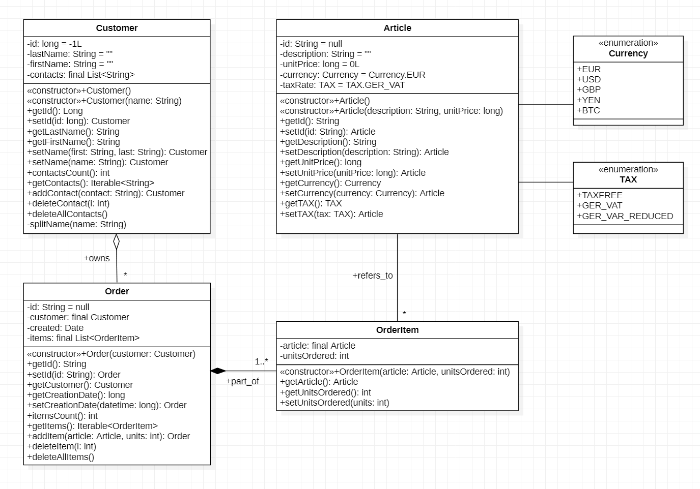

<!-- 
    README.md in branch C12
 -->

# Aufgabe D12: *Datamodel*

The assignment completes the datamodel with classes *Article.java*, *Order.java*
and *OrderItem.java* classes. *Customer.java* already exists from the previous
assignment. In addition, two *enum* are used in the data model:
*Currency.java* amd *TAX.java*.

The data model is (UML Class Diagram, see also StarUML-file:
[Datamodel.mdj](src/datamodel/Datamodel.mdj)
):




Content:

- [Setup](#1-setup)
    - Building the Application
    - Running the Application

- [D1: Completing the Datamodel](#2-d1-completing-the-datamodel)
    - Datamodel Generation and Completion
    - Running JUnit Tests

- [D2: Completing Features](#3-completing-features)
    - New Articles, Customers and Orders (steps 1-3)
    - *find()* - method (step 4)
    - *printOrder()* - method (steps 5)
    - order value and tax calculations (steps 6-9)


- [Release Preparation](#4-release-preparation)
    - Generating Javadoc
    - Packaging and Running the Application


&nbsp;
## 1. Setup

Fetch branch `D12` into project `se1.bestellsystem` from the remote repository:

```sh
cd se1.bestellsystem            # change into project directory
source .env/setenv.sh           # sourcing the project
git fetch origin D12            # fetch branch C12 from the remote repository
```
```

```

You are now on a new local branch `D12` (*) with the fetched content.

```sh
find src tests                  # show content of src and test
```
```

```


### 1.a Building the Application

Compile and run code with:

```sh
mk clean compile run
```

[Application_C1.java](https://github.com/sgra64/se1.bestellsystem/blob/C12/src/application/Application_C1.java)
creates *Customer* objects:

```java
final Customer eric = new Customer("Eric Meyer")
    .setId(892474L)     // set id, first time
    .setId(947L)        // ignored, since id can only be set once
    .addContact("eric98@yahoo.com")
    .addContact("eric98@yahoo.com") // ignore duplicate contact
    .addContact("(030) 3945-642298");

final Customer anne = new Customer("Bayer, Anne")
    .setId(643270L)
    .addContact("anne24@yahoo.de")
    .addContact("(030) 3481-23352")
    .addContact("fax: (030)23451356");
...
```

and prints a table with *Customer* information:


Output (table is initially empty):

```
+------+---------------------------------+----------------------------------+
|ID    | NAME                            | CONTACTS                         |
+------+---------------------------------+----------------------------------+
|892474| Meyer, Eric                     | eric98@yahoo.com, (+1 contacts)  |
|643270| Bayer, Anne                     | anne24@yahoo.de, (+2 contacts)   |
|286516| Schulz-Mueller, Tim             | tim2346@gmx.de                   |
|412396| Blumenfeld, Nadine-Ulla         | +49 152-92454                    |
|456454| Abdelalim, Khaled Saad Mohamed  | +49 1524-12948210                |
+------+---------------------------------+----------------------------------+
```


&nbsp;
## 2. D1: Completing the Datamodel
    - Datamodel Generation and Completion
    - Running JUnit Tests


Implement methods in
[Customer.java](https://github.com/sgra64/se1.bestellsystem/blob/C12/src/application/Customer.java)
starting with Constructors.

Add Tests one-after-another as you progress with implementations.

Complete one test (showing the correct implementation) before continuing with the next test.

```sh
mk compile-tests
```

Complete constructor tests first:

```sh
java -jar branches/libs/libs/junit-platform-console-standalone-1.9.2.jar \
    $(eval echo $JUNIT_OPTIONS) \
    -c application.Application_0_always_pass_Tests \
    -c datamodel.Customer_100_Constructor_Tests
```

Add more tests as you progress with the implementation:

```
    -c datamodel.Customer_100_Constructor_Tests \
    -c datamodel.Customer_100_Constructor_Tests \
    -c datamodel.Customer_200_SetId_Tests \
    -c datamodel.Customer_300_SetName_Tests \
    -c datamodel.Customer_400_Contacts_Tests \
    -c datamodel.Customer_500_SetNameExtended_Tests
```

The full test-suite of *Customer* tests runs

```sh
mk run-tests
```

Output:

```
├─ JUnit Jupiter ✔
│  └─ Application_0_always_pass_Tests ✔
│     ├─ test_001_always_pass() ✔
│     └─ test_002_always_pass() ✔
|  ...
|
├─ JUnit Vintage ✔
└─ JUnit Platform Suite ✔

Test run finished after 142 ms
[        55 tests successful      ]   <-- 55 tests successful
[         0 tests failed          ]   <--  0 tests failed
done.
```

Run JUnit-Tests also in your IDE.


&nbsp;
## 3. D2: Completing Features
    - New Articles, Customers and Orders (steps 1-3)
    - *find()* - method (step 4)
    - *printOrder()* - method (steps 5)
    - order value and tax calculations (steps 6-9)

### New Articles, Customers and Orders (steps 1-3)

### *find()* - method (step 4)

### *printOrder()* - method (steps 5)

### order value and tax calculations (steps 6-9)


&nbsp;
## 4. Release Preparation


### 4.a Generating Javadoc

Build the javadoc for the project.

```sh
mk javadoc
```

Open `docs/index.html` in a browser.


### 4.b Packaging and Running the Application

The packaged application will be `bin/application-1.0.0-SNAPSHOT.jar`.

```sh
mk package                  # run packaging
ls -la bin                  # show result in bin directory
```

Output:

```
total 16
drwxr-xr-x 1     0 May  5 23:18 ./
drwxr-xr-x 1     0 May  5 23:17 ../
-rw-r--r-- 1 20742 May  5 23:18 application-1.0.0-SNAPSHOT.jar
drwxr-xr-x 1     0 May  5 23:17 classes/
drwxr-xr-x 1     0 May  5 23:17 resources/
drwxr-xr-x 1     0 May  5 23:17 test-classes/
```


Run the packaged jar-file with:

```sh
mk run-jar
java -jar bin/application-1.0.0-SNAPSHOT.jar
```

Output:

```
Hello, Application_C1
+------+---------------------------------+----------------------------------+
|ID    | NAME                            | CONTACTS                         |
+------+---------------------------------+----------------------------------+
|892474| Meyer, Eric                     | eric98@yahoo.com, (+1 contacts)  |
|643270| Bayer, Anne                     | anne24@yahoo.de, (+2 contacts)   |
|286516| Schulz-Mueller, Tim             | tim2346@gmx.de                   |
|412396| Blumenfeld, Nadine-Ulla         | +49 152-92454                    |
|456454| Abdelalim, Khaled Saad Mohamed  | +49 1524-12948210                |
+------+---------------------------------+----------------------------------+
```

The packaged .jar file can now be distributed.
